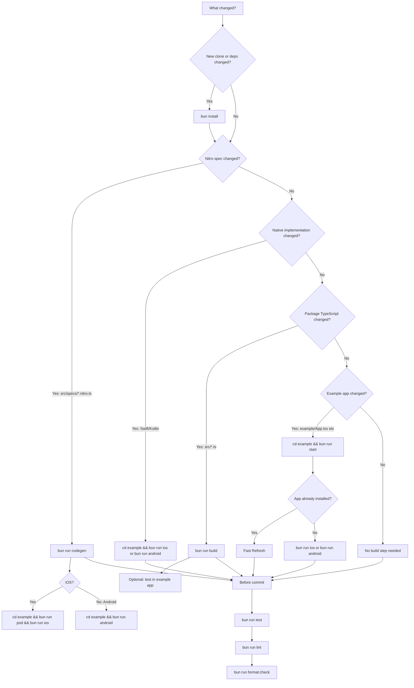

# Development Workflow

Use this to decide which command to run after a change.



## One-Time Setup

```sh
bun install
bun run codegen
cd example
bun run pod # iOS only
```

Do not run `bun install` every time. Run it for a new clone or when dependencies change.

## If/Then

| Change                              | Run                                                        |
| ----------------------------------- | ---------------------------------------------------------- |
| New clone                           | `bun install`                                              |
| Dependencies changed                | `bun install`                                              |
| Nitro spec changed                  | `bun run codegen`                                          |
| Package TypeScript changed          | `bun run build`                                            |
| Swift/Kotlin implementation changed | `cd example && bun run ios` or `bun run android`           |
| iOS native deps/pods changed        | `cd example && bun run pod`                                |
| Example app JS changed              | `cd example && bun run start`                              |
| Run iOS app                         | `cd example && bun run ios`                                |
| Run iOS physical device             | open `example/ios/NitroHealthExample.xcworkspace` in Xcode |
| Run Android app                     | `cd example && bun run android`                            |
| Run fast tests                      | `bun run test`                                             |
| Check lint                          | `bun run lint`                                             |
| Fix lint                            | `bun run lint:fix`                                         |
| Check formatting                    | `bun run format:check`                                     |
| Apply formatting                    | `bun run format`                                           |

## Common Flows

### TDD Loop

Use Jest for fast JS/API behavior tests. Use native app builds for platform smoke tests.

```sh
bun run test
```

When the test is red, implement the smallest change. When it is green, run the relevant build or native smoke step from the sections below.

### Changed Nitro Spec

Example: added or renamed a method in `src/specs/*.nitro.ts`.

```sh
bun run codegen
bun run test
cd example
bun run pod # iOS only
bun run ios # or bun run android
```

`bun run codegen` already runs `build`, so do not run both unless you specifically want a build without regenerating Nitro files.

### Changed Swift/Kotlin Only

Example: changed method behavior but the `.nitro.ts` signature stayed the same.

```sh
cd example
bun run ios # or bun run android
```

No `codegen` needed. Run `bun run test` from the repo root if JS behavior or example UI changed too.

### Changed Package TypeScript Only

Example: changed `src/index.ts`.

```sh
bun run build
bun run test
```

If you want to test it in the app:

```sh
cd example
bun run start
```

### Changed Example App Only

Example: changed `example/App.tsx`.

```sh
cd example
bun run start
```

Run the fast tests if behavior changed:

```sh
bun run test
```

Fast Refresh should pick it up if the app is already installed. If not:

```sh
bun run ios # or bun run android
```

## iOS Physical Device Signing

Simulator builds are the default OSS workflow and need no signing setup.

For a physical iPhone:

```sh
open example/ios/NitroHealthExample.xcworkspace
```

In Xcode, select the `NitroHealthExample` target → **Signing & Capabilities** → swap **Team** to your own Apple team. If the bundle ID conflicts with another app on your Apple ID, change it (e.g. `com.yourname.nitrohealth`).

Do not commit your local signing changes in `project.pbxproj`. Revert before staging:

```sh
git restore example/ios/NitroHealthExample.xcodeproj/project.pbxproj
```

## Before Commit

```sh
bun run test
bun run lint
bun run format:check
```

Use `bun run lint:fix` for safe lint fixes. Use `bun run format` only when you are ready to accept formatting changes.
