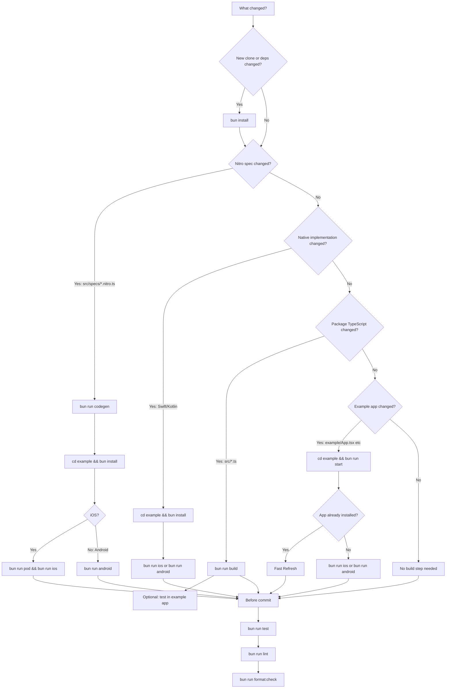

# Development Workflow

Use this to decide which command to run after a change.



## One-Time Setup

```sh
bun install
bun run codegen
cd example
bun run pod # iOS only
```

Do not run `bun install` every time. Run it for a new clone or when dependencies change.

After codegen or any native (Swift/Kotlin) change, run `cd example && bun install` before rebuilding the example app. Bun's workspace linking otherwise leaves the example app building against a stale copy of the library in `example/node_modules`, which manifests as `undefined is not a function` when calling a newly added method — even though `bun run codegen`/`bun run build` succeeded and the native code is correct.

## If/Then

| Change                              | Run                                                                 |
| ----------------------------------- | ------------------------------------------------------------------- |
| New clone                           | `bun install`                                                       |
| Dependencies changed                | `bun install`                                                       |
| Nitro spec changed                  | `bun run codegen` then `cd example && bun install`                  |
| Package TypeScript changed          | `bun run build`                                                     |
| Swift/Kotlin implementation changed | `cd example && bun install` then `bun run ios` or `bun run android` |
| iOS native deps/pods changed        | `cd example && bun run pod`                                         |
| Example app JS changed              | `cd example && bun run start`                                       |
| Run iOS app                         | `cd example && bun run ios`                                         |
| Run iOS physical device             | open `example/ios/NitroHealthExample.xcworkspace` in Xcode          |
| Run Android app                     | `cd example && bun run android`                                     |
| Run fast tests                      | `bun run test`                                                      |
| Typecheck package and example       | `bun run typecheck && bun run typecheck:example`                    |
| Check lint                          | `bun run lint`                                                      |
| Fix lint                            | `bun run lint:fix`                                                  |
| Check formatting                    | `bun run format:check`                                              |
| Apply formatting                    | `bun run format`                                                    |

## Common Flows

### Native Module Harness

Use React Native Harness for JS tests that execute inside the real iOS/Android app runtime with access to Nitro native modules.

```sh
cd example
bun run harness:ios
bun run harness:android
```

Harness uses `example/rn-harness.config.mjs`. Override local device names when needed:

```sh
RN_HARNESS_IOS_SIMULATOR='iPhone 17 Pro' RN_HARNESS_IOS_RUNTIME='26.0' bun run harness:ios
RN_HARNESS_ANDROID_AVD='Pixel_7_API_35' RN_HARNESS_ANDROID_API_LEVEL='35' RN_HARNESS_ANDROID_PROFILE='pixel_7' bun run harness:android
```

Harness does not build the app. Build and install the debug app first with `bun run ios` or `bun run android`, then run the Harness command. After native changes, rebuild/reinstall before running Harness again.

The GitHub Actions Harness workflow runs Android runtime validation on pull requests and `main` pushes that touch native/spec/example paths. iOS remains manual-only to avoid burning macOS minutes while simulator reliability is still being proven. Run it from **Actions → Run Harness → Run workflow** when you want to manually validate Android, iOS, or both.

Set `permissions: true` in the Harness config only when adding tests that need Harness-managed permission prompt handling.

The permission Harness tests intentionally skip interactive request flows unless the requested permission is already unnecessary/granted. HealthKit and Health Connect use specialized permission sheets, so do not assume Harness can auto-accept them like camera/location prompts.

HealthKit observer callbacks can be exercised while the iOS Harness app is running, but true background server delivery and cold-launch wakeups require a signed physical device. Validate configured observer restoration after an OS-terminated launch, a change written by another source while the app is backgrounded, pending notification handoff before JavaScript is ready, locked-device retry, permission revocation, and disable/re-enable behavior. A user force-quit can suppress HealthKit relaunch and is not equivalent to OS termination.

Android Harness can verify background-read feature and permission status. Scheduling, Doze behavior, process death, reboot, and force-stop behavior belong to the consumer application's WorkManager integration and remain outside this library's Harness suite.

### Android Native Unit Tests

Use JVM unit tests for pure Kotlin logic that does not need Android framework state, Health Connect, or user permissions.

Run from the repository root:

```sh
bun run test:android:native
```

You can also open `example/android` in Android Studio, then run `DailyBucketUtilsTest` or `HealthConnectPermissionUtilsTest` from the editor gutter or test class context menu.

The first native unit tests cover daily bucket shaping helpers: clamping bucket ranges to the requested query, ordering buckets, and applying `limit`. Keep Health Connect client calls, permission prompts, and device/provider behavior in Harness or manual device tests instead.

### iOS Native Unit Tests

Use SwiftPM/XCTest for pure Swift logic that does not need HealthKit runtime state, permissions, CocoaPods, or Nitro-generated values.

Run from the repository root:

```sh
bun run test:ios:native
```

This delegates to `swift test` through the test-only root `Package.swift`. The package includes only pure helper files such as `ios/DailyBucketUtils.swift`; the production iOS pod still builds through `NitroHealth.podspec`. Keep `HKHealthStore`, query execution, and permission prompts in Harness or manual device tests instead.

### TDD Loop

Use Jest for fast JS/API behavior tests. Use native app builds for platform smoke tests.

```sh
bun run test
```

When the test is red, implement the smallest change. When it is green, run the relevant build or native smoke step from the sections below.

### Changed Nitro Spec

Example: added or renamed a method in `src/specs/*.nitro.ts`.

```sh
bun run codegen
bun run test
cd example
bun install # required: re-links the example app to the rebuilt library, see note above
bun run pod # iOS only
bun run ios # or bun run android
```

`bun run codegen` already runs `build`, so do not run both unless you specifically want a build without regenerating Nitro files.

### Changed Swift/Kotlin Only

Example: changed method behavior but the `.nitro.ts` signature stayed the same.

```sh
cd example
bun install # required, see note above — skipping it silently rebuilds against the stale library copy
bun run ios # or bun run android
```

No `codegen` needed. Run `bun run test` from the repo root if JS behavior or example UI changed too.

### Changed Package TypeScript Only

Example: changed `src/index.ts`.

```sh
bun run build
bun run test
```

If you want to test it in the app:

```sh
cd example
bun run start
```

### Changed Example App Only

Example: changed `example/App.tsx`.

```sh
cd example
bun run start
```

Run the fast tests if behavior changed:

```sh
bun run test
```

Fast Refresh should pick it up if the app is already installed. If not:

```sh
bun run ios # or bun run android
```

## Consumer App Setup

The library deliberately ships **no health permissions**. Consumer apps must declare every data type they read or write. This avoids forcing every downstream app to inherit permissions it doesn't use, which would fail Play Store privacy review.

The `example/` app is a working reference — copy from it.

### iOS

1. Enable HealthKit capability in Xcode: target → **Signing & Capabilities** → **+ Capability** → **HealthKit**. This adds an `.entitlements` file referencing `com.apple.developer.healthkit`.
2. Add to the app's `Info.plist`:
   ```xml
   <key>NSHealthShareUsageDescription</key>
   <string>Why your app reads health data.</string>
   <key>NSHealthUpdateUsageDescription</key>
   <string>Why your app writes health data.</string>
   ```
   These strings appear in the system permission prompt. Apple rejects vague text — explain the user-visible feature.
3. (Optional) For clinical health records, also add the `com.apple.developer.healthkit.access` entitlement with `health-records` and `NSHealthClinicalHealthRecordsShareUsageDescription` in Info.plist.

Reference: `example/ios/NitroHealthExample/NitroHealthExample.entitlements`, `example/ios/NitroHealthExample/Info.plist`.

### Android

1. Declare each Health Connect data type permission in your `AndroidManifest.xml`:
   ```xml
   <uses-permission android:name="android.permission.health.READ_STEPS" />
   <uses-permission android:name="android.permission.health.WRITE_STEPS" />
   <uses-permission android:name="android.permission.health.READ_DISTANCE" />
    <uses-permission android:name="android.permission.health.READ_ACTIVE_CALORIES_BURNED" />
    <uses-permission android:name="android.permission.health.READ_HEART_RATE" />
     <uses-permission android:name="android.permission.health.READ_SLEEP" />
     <uses-permission android:name="android.permission.health.WRITE_SLEEP" />
    <uses-permission android:name="android.permission.health.READ_WEIGHT" />
    <!-- declare only the data types your app reads or writes -->
   ```
   Full list: <https://developer.android.com/health-and-fitness/guides/health-connect/plan/data-types>.
2. Add a `<queries>` block so the app can see the Health Connect provider package on Android 11+ (the library declares this too, but explicit in the consumer manifest avoids manifest-merger surprises):
   ```xml
   <queries>
     <package android:name="com.google.android.apps.healthdata" />
   </queries>
   ```
3. Create a `PermissionsRationaleActivity` that displays the app's privacy policy. The system launches this when the user taps the privacy policy link in the Health Connect permissions screen. Register it with two intent-filters — one for Android <14 (`androidx.health.ACTION_SHOW_PERMISSIONS_RATIONALE`), one for Android 14+ (an `<activity-alias>` named `ViewPermissionUsageActivity` with `android.intent.action.VIEW_PERMISSION_USAGE`). The activity must show the same privacy policy you list in Play Console.

Reference: `example/android/app/src/main/AndroidManifest.xml`, `example/android/app/src/main/java/com/nitrohealth/example/PermissionsRationaleActivity.kt`.

## iOS Physical Device Signing

Simulator builds are the default OSS workflow and need no signing setup.

For a physical iPhone:

```sh
open example/ios/NitroHealthExample.xcworkspace
```

In Xcode, select the `NitroHealthExample` target → **Signing & Capabilities** → swap **Team** to your own Apple team. If the bundle ID conflicts with another app on your Apple ID, change it (e.g. `com.yourname.nitrohealth`).

Do not commit your local signing changes in `project.pbxproj`. Revert before staging:

```sh
git restore example/ios/NitroHealthExample.xcodeproj/project.pbxproj
```

## Before Commit

```sh
bun run test
bun run lint
bun run format:check
```

Use `bun run lint:fix` for safe lint fixes. Use `bun run format` only when you are ready to accept formatting changes.
